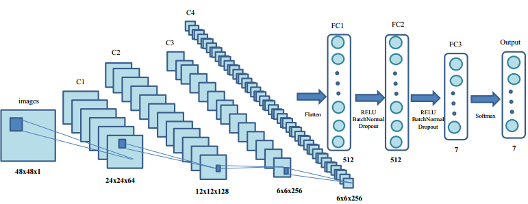
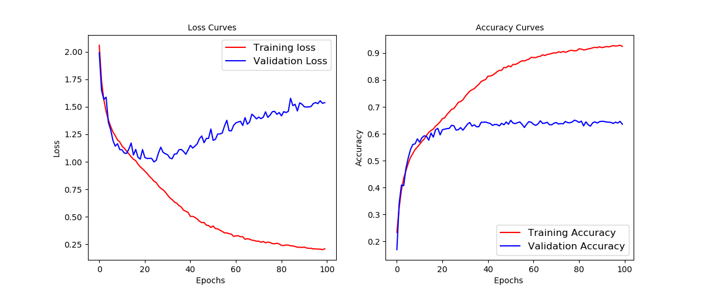
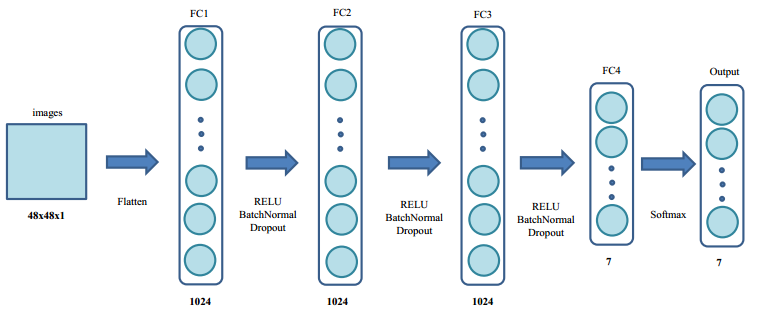
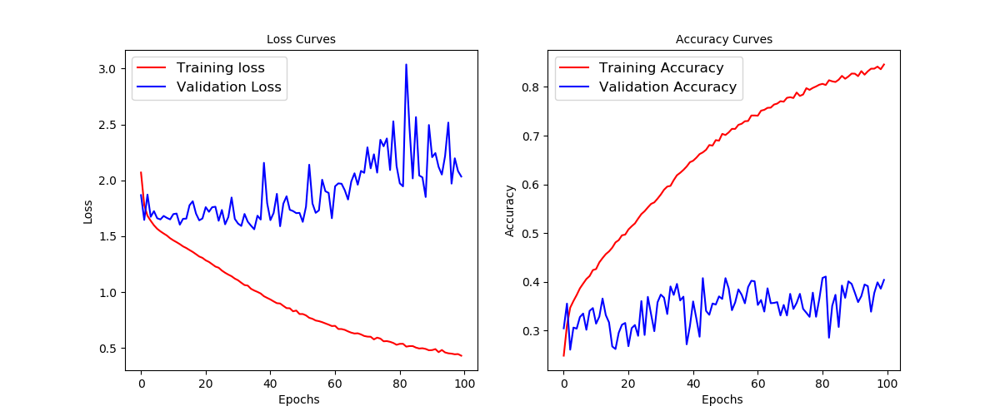
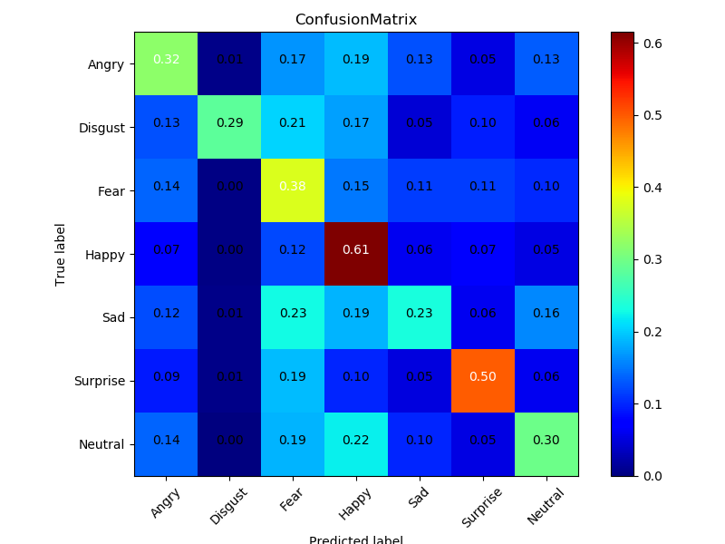
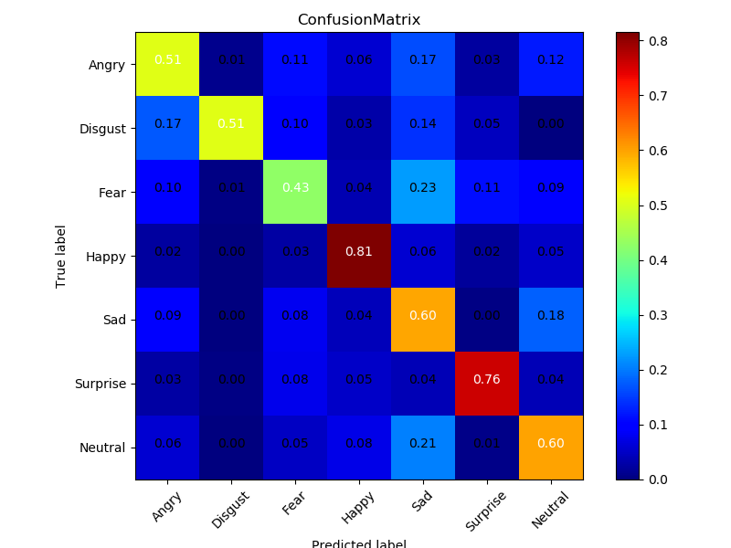

# Homework 3

## Purpose: Image Sentiment Classification

本次作業為人臉表情情緒分類，總共有七種可能的表情（0：生氣, 1：厭惡, 2：恐懼, 3：高興, 4：難過, 5：驚訝, 6：中立(難以區分為前六種的表情))。

本次作業利用 training dataset 訓練一個 CNN model，預測出每張圖片的表情 label（同樣地，為 0~6 中的某一個)，並跟參數個數差不多的 DNN model 去進行比較。

## Data 簡介

* training dataset 為兩萬八千張左右 48x48 pixel的圖片，以及每一張圖片的表情 label（注意：每張圖片都會唯一屬於一種表情）。

* Testing dataset 則是七千張左右 48x48 的圖片

* 如下圖，由左至右依序為生氣、厭惡、恐懼、高興、難過、驚訝、中立

* 各類別數量
<table style="width:50%">
  <tr>
    <td>**0：生氣** </td> 
    <td> 3995 </td> 
  </tr>
  
  <tr>
    <td>**1：厭惡**</td>
    <td> 436 </td> 
  </tr>
  
  <tr>
    <td>**2：恐懼**</td>
    <td> 4097 </td> 
  </tr>

  <tr>
    <td>**3：高興**</td>
    <td> 7215 </td> 
  </tr>

  <tr>
    <td>**4：難過**</td>
    <td> 4830 </td> 
  </tr>

  <tr>
    <td>**5：驚訝**</td>
    <td> 3171 </td> 
  </tr>

  <tr>
    <td>**6：中立**</td>
    <td> 4965 </td> 
  </tr>
  
</table>

## Summary 總結

在資料處理的部分，先將 training data 進行標準化，並取出最後 5000 資料當作 validation data (大約 20% 資料量)。

首先 CNN model 模型架構如下圖所示，其中 C1、C2、C3、C4 為 Convolution layer，包含 Convolution2D()、BatchNormalization()、Activation()、MaxPooling2D() 和 Dropout()。

- Convolution2D() : Filter Size 均為 (3,3)，Strides 均為 1
- BatchNormalization() : 讓每批量的數據分布相似並達到加速收斂的效果，另一個目的為讓 training data、validation data 和 testing data 數據分布相似，提高模型的泛化能力和避免 overfitting
- Activation() : 均使用 Relu
- MaxPooling2D() : Pooling size 均為 (2,2)，Strides 均為 2
- Dropout() : C1、C2、C3、C4、FC1、FC2 的 dropout rate 依序為 0.3, 0.3, 0.3, 0.4, 0.5, 0.5

模型總參數數量為 4,183,815，其中有 3968 個是 BatchNormalization() 的 non-trainable 個數。

在 CNN model 訓練過程中，可以觀察到大約在 20 個 epoch 左右，validation loss 來到了低點，validation accuracy 似乎也到了極限 (63.86%)。在 20 個 epoch 之後 validation accuracy 只有稍為的提升，最好的 validation accuracy 為 65.54% 。

DNN model 模型架構如圖下所示，其中 FC1、FC2、FC3、FC4 為 Fully Connection layer，包含 BatchNormalization()、Activation() 和 Dropout()。

- BatchNormalization() : 目的為加速收斂和避免 overfitting
- Activation() : 均使用 Relu
- Dropout() : FC1、FC2、FC3 的 dropout rate 均為 0.5

模型總參數數量為 4,478,983，其中有 6,144 個是 BatchNormalization() 的 non-trainable 個數。

在 DNN model 訓練過程中，我觀察到與 CNN model 差異點有:

- DNN model 的 validation accuracy 完全無法跟 CNN model 相比。
- 訓練速度上 DNN model 速度完勝於 CNN model 。 DNN model 一個 epoch 大約 20sec 而 CNN model 約 200sec。個人猜測主要原因為 Convolution 需要消耗比較多的運算。
- 在 validation loss 部分似乎不是很樂觀，在 40 個 epoch 之後甚至有上升的趨勢。

### Confusion Matrix

這個部分分別針對 DNN 和 CNN model 計算 confusion matrix 並且利用視覺化的方式呈現結果。

DNN model 的部分，根據 confusion matrix (下圖) 可以知道，

- 唯獨開心 (Hppy) 和中立 (Neutral) 模型的正確辨識程度高過於 50%，這兩類剛好也是資料數量最多的兩類。
- 模型似乎捕捉不到在各種情緒上的細微差異，導致各類別容易誤判成中立 (Neutral)。

 CNN model，根據 confusion matrix (下圖) 來看，

- 很清楚的知道各類別預測狀況相對於 DNN model 來說進步很多。
- 害怕 (Fear) 很容易會誤判成傷心 (Sad)，誤判機率大約 22%。
- 中立 (Neutral) 和傷心 (Sad) 相對於模型來說不容易分辨，彼此誤判的機率差不多 20%。
- 生氣 (Angry) 會被誤判成傷心 (sad)，誤判機率大約 17%。
- 厭惡 (Disgust) 會被誤判成生氣 (Angry)，誤判機率大約 16%。
- 在開心 (Hppy) 和驚訝 (Surprise) 這種表情鮮明的類別，模型的辨識狀況相對而言就會比較好，而生氣 (Angry)、厭惡 (Disgust)、害怕 (Fear) 這種複雜的情緒對模型來說相對而言也比較難辨識其中差異，甚至連人類都不太容易分辨出差異點。

### Saliency Map

這部份主要是要觀察圖片每個 pixel 對於 CNN model 預測結果的影響力，藉此來了解模型在做分類時主要是 focus 在圖片哪個部分。

做法其實很簡單，只要針對圖片的預測結果對每個 pxiel 進行微分，再取絕對值，就知道哪個 pxiel 對模型預測的影響力比較大。另外先定義符號， 為模型預測的 label， 為圖片， 為圖片的 pixel ，數學上的表達為  簡單說就是該值越大，代表影響力越大。

以下為將上述的內容用視覺化的方式表達出來。下列圖中最左邊的原圖分別從 5000 筆 validation data 中選出的各類別預測正確照片，由上到下 label 分別為 生氣 (Angry)#23、厭惡 (Disgust)#189、害怕 (Fear)#53、開心 (Happy)#2、傷心 (Sad)#6、驚訝 (Surprise)#15、中立 (Neutral)#4。

從第四張類別 Happy 的 heatmap 可以發現在嘴巴部分有較高的值，可見模型在做分類時，是將重點放在偵測嘴巴的部分，而這張圖被判定為 Happy 的主要依據也是因為嘴巴的笑容。第七張類別 Surprise 的 heatmap 可以發現眼睛和嘴巴部位的值相對於其他部位來的高，很清楚的知道模型再對這類別做分類的重點是在眼睛和嘴巴，其他類別雖然沒有特別明顯的部位，但主要都將重點放在臉部。

### Visualizing Filters

利用 gradient ascent，觀察 filter 被 activate 的情況。

下圖左邊為第一層 convolution 後的 filter，右邊為 validation data 中的第二筆資料 (Saliency Map Happy 類別的原圖) 經過第一層 convolution 的結果。

    
    

接下來將經過完整的 convolution block (convolution->batch normalization->activation) 後的 filter 取出來 (下圖左)。發現其實每個 filter 都是由基本的線條所組成且看起來很相似，但可以觀察到有個現象是，filter 中的線條似乎傾斜角度有不同(旋轉)，猜測可能是因為照片臉的角度有正臉、側臉等因素造成的，最後可以將這個 layer 理解成被基本的紋理所 activate。右圖則為經過第一個 convolution block 的結果。

    
    

之後數層 convolution 後的 filter 和 convolution block 後的 filter 以及 validation data 中的第二筆資料相對應該層的輸出結果如下列所示:

    <figcaption>&nbsp;&nbsp;&nbsp;&nbsp;&nbsp;&nbsp;&nbsp;&nbsp;&nbsp;&nbsp;&nbsp;&nbsp;&nbsp;&nbsp;&nbsp;&nbsp;&nbsp;第二層 convolution 後的 filter &nbsp;&nbsp;&nbsp;&nbsp;&nbsp;&nbsp;&nbsp;&nbsp;&nbsp;&nbsp;&nbsp;&nbsp;&nbsp;&nbsp;&nbsp;&nbsp;&nbsp;&nbsp;&nbsp;&nbsp;&nbsp;&nbsp;&nbsp;&nbsp;&nbsp;&nbsp;&nbsp;&nbsp;&nbsp;&nbsp;&nbsp; 第二層 validation data convolution 後的結果</figcaption>
    
    

    <figcaption>&nbsp;&nbsp;&nbsp;&nbsp;&nbsp;&nbsp;&nbsp;&nbsp;&nbsp;&nbsp;&nbsp;&nbsp;&nbsp;&nbsp;&nbsp;&nbsp;第二層 convolution block 後的 filter &nbsp;&nbsp;&nbsp;&nbsp;&nbsp;&nbsp;&nbsp;&nbsp;&nbsp;&nbsp;&nbsp;&nbsp;&nbsp;&nbsp;&nbsp;&nbsp;&nbsp;&nbsp;&nbsp;&nbsp;&nbsp;&nbsp;&nbsp; 第二層 validation data convolution block 後的結果</figcaption>
    
    

    <figcaption>&nbsp;&nbsp;&nbsp;&nbsp;&nbsp;&nbsp;&nbsp;&nbsp;&nbsp;&nbsp;&nbsp;&nbsp;第三層 convolution 後的 filter &nbsp;&nbsp;&nbsp;&nbsp;&nbsp;&nbsp;&nbsp;&nbsp;&nbsp;&nbsp;&nbsp;&nbsp;&nbsp;&nbsp;&nbsp;&nbsp;&nbsp;&nbsp;&nbsp;&nbsp;&nbsp;&nbsp;&nbsp;&nbsp;&nbsp;&nbsp;&nbsp;&nbsp;&nbsp;&nbsp;&nbsp;&nbsp;&nbsp;&nbsp;&nbsp;&nbsp;&nbsp;&nbsp;&nbsp;&nbsp;&nbsp;&nbsp;&nbsp; 第三層 validation data convolution 後的結果</figcaption>
    
    

    <figcaption>&nbsp;&nbsp;&nbsp;&nbsp;&nbsp;&nbsp;&nbsp;&nbsp;&nbsp;&nbsp;&nbsp;&nbsp;&nbsp;&nbsp;&nbsp;&nbsp;&nbsp;&nbsp;&nbsp;&nbsp;第三層 convolution block 後的 filter &nbsp;&nbsp;&nbsp;&nbsp;&nbsp;&nbsp;&nbsp;&nbsp;&nbsp;&nbsp;&nbsp;&nbsp;&nbsp;&nbsp;&nbsp;&nbsp;&nbsp;&nbsp;&nbsp;&nbsp;&nbsp;&nbsp;&nbsp;&nbsp;&nbsp; 第三層 validation data convolution block 後的結果</figcaption>
    
    

    <figcaption>&nbsp;&nbsp;&nbsp;&nbsp;&nbsp;&nbsp;&nbsp;&nbsp;&nbsp;&nbsp;&nbsp;&nbsp;第四層 convolution 後的 filter &nbsp;&nbsp;&nbsp;&nbsp;&nbsp;&nbsp;&nbsp;&nbsp;&nbsp;&nbsp;&nbsp;&nbsp;&nbsp;&nbsp;&nbsp;&nbsp;&nbsp;&nbsp;&nbsp;&nbsp;&nbsp;&nbsp;&nbsp;&nbsp;&nbsp;&nbsp;&nbsp;&nbsp;&nbsp;&nbsp;&nbsp;&nbsp;&nbsp;&nbsp;&nbsp;&nbsp;&nbsp;&nbsp;&nbsp;&nbsp;&nbsp;&nbsp;&nbsp; 第四層 validation data convolution 後的結果</figcaption>
    
    

    <figcaption>&nbsp;&nbsp;&nbsp;&nbsp;&nbsp;&nbsp;&nbsp;&nbsp;&nbsp;&nbsp;&nbsp;&nbsp;&nbsp;&nbsp;&nbsp;&nbsp;&nbsp;&nbsp;&nbsp;&nbsp;第四層 convolution block 後的 filter &nbsp;&nbsp;&nbsp;&nbsp;&nbsp;&nbsp;&nbsp;&nbsp;&nbsp;&nbsp;&nbsp;&nbsp;&nbsp;&nbsp;&nbsp;&nbsp;&nbsp;&nbsp;&nbsp;&nbsp;&nbsp;&nbsp;&nbsp;&nbsp;&nbsp; 第四層 validation data convolution block 後的結果</figcaption>
    
    

### Data Augmentation

### 心得:

在做這份作業的過程中，如果沒有將pixel除以255，模型訓練效果會非常差，主要原因是因為沒有除以255導致模型訓練速度過慢，在沒有良好的設備和時間的情況下，結果都不會太優。而除以255之後 pixel 數值會分布在0~1之間，這樣可以加速模型的訓練，以至於在同樣的模型相同的訓練次數結果會差很多。###要在驗證

隨著 Convolution 越來越多層，模型在訓練集的預測正確率可以高達90%以上，但在驗證集始終無法突破 55% 的預測正確率，這現象意味著模型過擬和訓練資料。面對這樣的問題我們採用 droupout 來抑制過擬合現象，首先在 fully connection 的部分採用 droupout，在驗證集的表現似乎有提升 3% ~ 5% 左右，但就是過不了 60% 。隨著 droupout 的強度越來越強，甚至對 Convolution 也進行 droupout 的過程中我們也可以發現在驗證集的正確預測率可以達到 65% 。

1. 照片需要除255 效果影響很大 50%以下

2. 3 個 conv + 2-3個 fc vail data ~50%~55%

3. 4 個 conv + 2-3個 fc vail data ~55%~60% basic droupout 0.2 on fc

4. 4 個 conv + 2-3個 fc vail data ~57%~63% basic droupout 0.2 on all layer                     15epoch

5. 4 個 conv + 2-3個 fc vail data ~60%~65% basic droupout 0.5 on fc layer 0.2 0.3 0.3 onconv   20epoch

## Reference

* [原始課程作業說明](https://docs.google.com/presentation/d/1QFK4-inv2QJ9UhuiUtespP4nC5ZqfBjd_jP2O41fpTc/edit?ts=58e452ff#slide=id.p)

* [Keras Image Data Augmentation 個參數詳解](https://zhuanlan.zhihu.com/p/30197320)

* [BatchNormalization](http://blog.csdn.net/hjimce/article/details/50866313)

* [How convolutional neural networks see the world](https://blog.keras.io/how-convolutional-neural-networks-see-the-world.html)