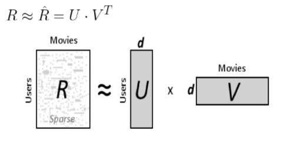

# Homework 5

## Purpose: Predict movie ratings

本次作業主要目標是利用 User 對 Movie 的歷史評分去預測 User 未曾觀看過 Movie 的評分。

主要以 matrix factorization 的方法去預測 User-Movie matrix 的遺失值。下列利用一個簡單的例子來做說明。

- 下表為 User A~E 對 Movie 1~4 的評分，本次目標就是利用這些評分去預測 ? 的部分。
  

<table style="width:80%">
  <tr>
    <td> </td> 
    <td> Movie 1 </td>
    <td> Movie 2 </td> 
    <td> Movie 3 </td> 
    <td> Movie 4 </td> 
  </tr>
  
  <tr>
    <td>User A</td>
    <td> 5 </td> 
    <td> 3 </td> 
    <td> ? </td> 
    <td> 1 </td> 
  </tr>
  
  <tr>
    <td>User B</td>
    <td> 4 </td> 
    <td> 3 </td> 
    <td> ? </td> 
    <td> 1 </td> 
  </tr>

  <tr>
    <td>User C</td>
    <td> 1 </td> 
    <td> 1 </td> 
    <td> ? </td> 
    <td> 5 </td> 
  </tr>

  <tr>
    <td>User D</td>
    <td> 1 </td> 
    <td> ? </td> 
    <td> 4 </td> 
    <td> 4 </td> 
  </tr>

  <tr>
    <td>User E</td>
    <td> ? </td> 
    <td> 1 </td> 
    <td> 5 </td> 
    <td> 4 </td> 
  </tr>
</table>

- matrix factorization 的概念為，將上列表格式為一個 User-Movie matrix，並利用 svd 矩陣分解的概念將 User-Movie matrix 拆解成 User matrix 和 Movie matrix。
 - 首先假設 u 個 User、m 部 Movie、d 個 latent factor、User-Movie matrix 為 、User matrix 為 、Movie matrix 為 。如下圖所示。
- 由於 User-Movie matrix 中存在遺失值，所以我們利用已知的評分去計算 loss function 。

## Data 簡介

* Training dataset 為 899873 筆資料，其中包含 XXX 位User 和 XXX 部電影。

* Testing dataset 則是 100336筆資料， 其中一半為 kaggle
 private set。

## Summary

## Reference

* [原始課程作業說明](https://docs.google.com/presentation/d/10a1ET-9m3ntQhGesxCpQOqPtab4ldUBBrq-i3o-h2HE/edit#slide=id.g2b65c05370_1_5)

* [Collaborative filtering in Keras](http://www.fenris.org/2016/03/07/index-html)

- batch_size=100 120SEC
batch_size=500 24SEC why??
1000 12SEC
