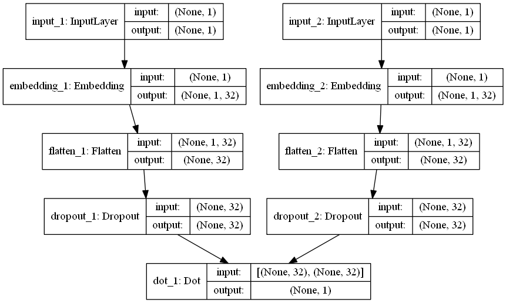
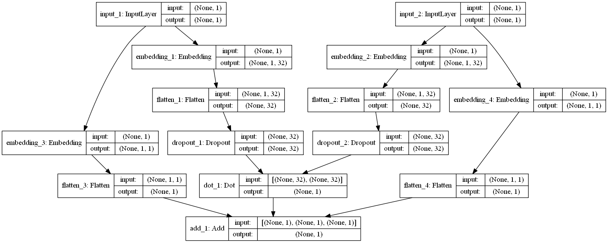

# Homework 5

## Purpose: Predict movie ratings

本次作業主要目標是利用 User 對 Movie 的歷史評分去預測 User 未曾觀看過 Movie 的評分。

主要以 matrix factorization 的方法去預測 User-Movie matrix 的遺失值。下列利用一個簡單的例子來做說明。

- 下表為 User A 到 E 對 Movie 1 到 4 的評分，本次目標就是利用這些已知評分去預測 ? 的部分。
  

<table style="width:80%">
  <tr>
    <td> </td> 
    <td> Movie 1 </td>
    <td> Movie 2 </td> 
    <td> Movie 3 </td> 
    <td> Movie 4 </td> 
  </tr>
  
  <tr>
    <td>User 1</td>
    <td> 5 </td> 
    <td> 3 </td> 
    <td> ? </td> 
    <td> 1 </td> 
  </tr>
  
  <tr>
    <td>User 2</td>
    <td> 4 </td> 
    <td> 3 </td> 
    <td> ? </td> 
    <td> 1 </td> 
  </tr>

  <tr>
    <td>User 3</td>
    <td> 1 </td> 
    <td> 1 </td> 
    <td> ? </td> 
    <td> 5 </td> 
  </tr>

  <tr>
    <td>User 4</td>
    <td> 1 </td> 
    <td> ? </td> 
    <td> 4 </td> 
    <td> 4 </td> 
  </tr>

  <tr>
    <td>User 5</td>
    <td> ? </td> 
    <td> 1 </td> 
    <td> 5 </td> 
    <td> 4 </td> 
  </tr>
</table>

- matrix factorization 的概念為，將上列表格式為一個 User-Movie matrix，並利用 svd 矩陣分解的概念將 User-Movie matrix 拆解成 User matrix 和 Movie matrix。
- 首先假設 u 個 User、m 部 Movie、d 個 latent factor、User-Movie matrix 為 、User matrix 為 、Movie matrix 為 。如下圖所示。
- 由於 User-Movie matrix 中存在遺失值，所以我們利用已知的評分去計算 loss function
 

## Data 簡介

* Training dataset 為 899873 筆資料，其中包含 6040 位 User 和 3688 部電影。

* Testing dataset 則是 100336 筆資料， 其中一半為 kaggle private set。

## Summary

在這次大約 90 萬筆 Training dataset 裡面，我們將最後面 8 萬筆資料當作 validation set。

一開始我們從最基本的 matrix factorization 出發，模型結構如下圖。

接下來我們增加模型的複雜度，在 User 和 Movie 分別增加 bias 項。

1. 比較有無 Bias 項訓練的結果。
   * latent factor 為 32
   * Batch Size 為 4096
   * dropout 為 0.8
   
<table style="width:80%">
  <tr>
    <td> </td> 
    <td> Training Loss </td>
    <td> Training RMSE </td> 
    <td> Valid Loss </td> 
    <td> Vaild RMSE </td> 
  </tr>
  
  <tr>
    <td>unBias</td>
    <td> 2.48 </td> 
    <td> 1.58 </td> 
    <td> 1.49 </td> 
    <td> 1.22 </td> 
  </tr>

  <tr>
    <td>Bias</td>
    <td> 0.86 </td> 
    <td> 0.93 </td> 
    <td> 0.88 </td> 
    <td> 0.94 </td> 
  </tr>
</table>

    
    

* 在模型有 Bias 項的情況下，比較有無 normalize(在 rating 上) 的差別。
   * latent factor 為 32
   * Batch Size 為 4096
   * dropout 為 0.8

<table style="width:80%">
  <tr>
    <td> </td> 
    <td> Training Loss </td>
    <td> Training RMSE </td> 
    <td> Valid Loss </td> 
    <td> Vaild RMSE </td> 
  </tr>
  
  <tr>
    <td>unNormalize</td>
    <td> 0.8613 </td> 
    <td> 0.9280 </td> 
    <td> 0.8775 </td> 
    <td> 0.9367 </td> 
  </tr>

  <tr>
    <td>Normalize</td>
    <td> 0.6363 </td> 
    <td> 0.7976 </td> 
    <td> 0.6389 </td> 
    <td> 0.7993 </td> 
  </tr>
</table>

    
    

*  比較不同的 latent dimension 的結果。

* bias + normal droupout 要調高才會訓練的好

## Stucture

## Reference

* [原始課程作業說明](https://docs.google.com/presentation/d/10a1ET-9m3ntQhGesxCpQOqPtab4ldUBBrq-i3o-h2HE/edit#slide=id.g2b65c05370_1_5)

* [Collaborative filtering in Keras](http://www.fenris.org/2016/03/07/index-html)

* [Recommender Systems in Keras](https://nipunbatra.github.io/blog/2017/recommend-keras.html)
