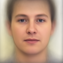
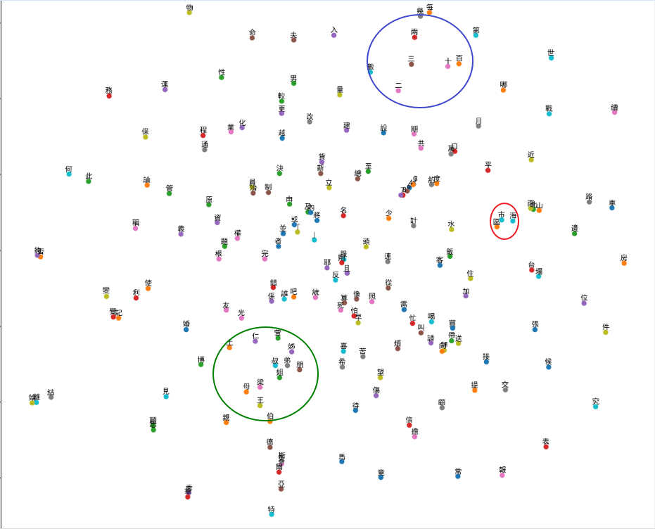

# Homework 6

## Purpose: Unsupervised learning & dimension reduction

### PART1: PCA of colored faces

#### Data 簡介

[數據集](https://drive.google.com/file/d/1IfPN_emmgGKZVqACjNj8fymDqwsDECyJ/view?usp=drive_open)來自 Aberdeen University 的 Prof. Ian Craw，並經過挑選及對齊，總共有 415 張 600 X 600 X 3 的彩圖。

#### Summary

這次 PCA 主要是要利用少數的維度來代表全部的維度，假設 <a href="https://www.codecogs.com/eqnedit.php?latex=X" target="_blank"></a> 為 <a href="https://www.codecogs.com/eqnedit.php?latex=n\times&space;p" target="_blank"></a> 的矩陣，其中 n 代表照片數量，p 代表照片維度。扣掉平均照片 <a href="https://www.codecogs.com/eqnedit.php?latex=\mu" target="_blank"></a> (平均臉)，可以得到中心矩陣 <a href="https://www.codecogs.com/eqnedit.php?latex=X" target="_blank"></a> 。

透過解 <a href="https://www.codecogs.com/eqnedit.php?latex=X^{T}X" target="_blank"></a> 可以得到 <a href="https://www.codecogs.com/eqnedit.php?latex=p\times&space;k" target="_blank"></a> 的 eigenvectors matrix <a href="https://www.codecogs.com/eqnedit.php?latex=V" target="_blank"></a>，其中 <a href="https://www.codecogs.com/eqnedit.php?latex=k" target="_blank"></a> 為我們要重建照片所使用的 eigenvectors，而通常都是前 <a href="https://www.codecogs.com/eqnedit.php?latex=k" target="_blank"></a> 大的 eigenvalues 所對應到的 eigenvectors。則利用 <a href="https://www.codecogs.com/eqnedit.php?latex=V" target="_blank"></a> 可以投影到低維的 <a href="https://www.codecogs.com/eqnedit.php?latex=n\times&space;k" target="_blank"></a> 矩陣 <a href="https://www.codecogs.com/eqnedit.php?latex=Z=&space;XV" target="_blank"></a>。
  
另外為了可以從低維度的 <a href="https://www.codecogs.com/eqnedit.php?latex=Z" target="_blank"></a> 重建回 <a href="https://www.codecogs.com/eqnedit.php?latex=X" target="_blank"></a>，所以將 <a href="https://www.codecogs.com/eqnedit.php?latex=Z" target="_blank"></a> 乘上 <a href="https://www.codecogs.com/eqnedit.php?latex=V^{T}" target="_blank"></a> 可得 <a href="https://www.codecogs.com/eqnedit.php?latex=\widehat{X}=&space;ZV^{T}=&space;XVV^{T}" target="_blank"></a>。但別忘了一開始有扣掉平均照片 <a href="https://www.codecogs.com/eqnedit.php?latex=\mu" target="_blank"></a> 。所以 <a href="https://www.codecogs.com/eqnedit.php?latex=\widehat{X}_{reconstruction}=&space;ZV^{T}&space;&plus;&space;\mu" target="_blank"></a> 。



<div class="half">
    
    
    
    
</div>

<div class="half">
    
    
    
    
</div>

<div class="half">
    
    
    
    
</div>

### PART2: Visualization of Chinese word embedding

#### Data 簡介

[數據集](https://drive.google.com/open?id=1E5lElPutaWqKYPhSYLmVfw6olHjKDgdK) 來自於課堂上 project 資料的彙整。用 '。’ 或 ‘\n’ 當做句子之間的分界，然後去掉長度小於 6 的總共有 578810 句。


#### Summary 


這次先使用 jieba 將句子做段詞，例如: "我叫你閉上眼睛" --> "妳 叫 我 閉上眼睛 \n"。再將段詞過後的詞，利用 gensim.model.word2vec 轉成向量。使用參數如下:

```
Word2Vec(lines, size=300, min_count=16, iter=20)
```

lines 為斷詞過後的句子，size 為每個詞的維度，min_count 為至少要出現超過這數字的詞才會被拿來 train， iter 為 training 迭代次數。

下圖為將每個詞的 vector 利用 TSNE 降維到 2，方便去做視覺化的呈現。



藍色圓圈為數字的部分，紅色為城市階級，綠色為稱呼。整體來說詞意越接近會越靠近。

### PART3: Image clustering

這次希望透過這個小傳案可以達到，分辨給定的兩張 images 是否來自同一個 datase。

#### Data 簡介

- image.npy.zip: 資料維度 140000 x 784, 共有 140000 張照片，每張照片 28x28。

- visualization.npy: 10000 x 784, 共有 10000 張照片，每張照片 28x28。前 5000 張來自於 datasets A，後 5000 張來自於 datasets B。

- test_case.csv: 

- sample_submission.csv: 


#### Summary 

## File Stucture

```
HW5/
|    README.md
|    pca.py
|    word2vec.py
|
└─── 01-RAWData/
|       Aberdeen/
|       image.npy
|       all_sents.txt
|
└─── Output/
|       pca/
|          AvgFace.png
|          .png
|          .png
|       .
|       .
|       .
|       word2vec/
|          visWord2vec.png
|          corpus_Seg.txt
|       .
|       .
|       .    
|___
```

## Reference

* [原始課程作業說明](https://docs.google.com/presentation/d/1v2aJnjqplnQ5YSprp6IXbWM_VPavtolqpgbGWM4HidY/edit)

* [人臉識別算法-特徵臉方法（Eigenface）及 python 實現](https://blog.csdn.net/u010006643/article/details/46417127)

* [PCA](https://stats.stackexchange.com/questions/229092/how-to-reverse-pca-and-reconstruct-original-variables-from-several-principal-com)

* [Word2vec](https://medium.com/pyladies-taiwan/%E8%87%AA%E7%84%B6%E8%AA%9E%E8%A8%80%E8%99%95%E7%90%86%E5%85%A5%E9%96%80-word2vec%E5%B0%8F%E5%AF%A6%E4%BD%9C-f8832d9677c8)

* [Matplotlib 顯示中文](https://codertw.com/%E4%BA%BA%E5%B7%A5%E6%99%BA%E6%85%A7/95662/)